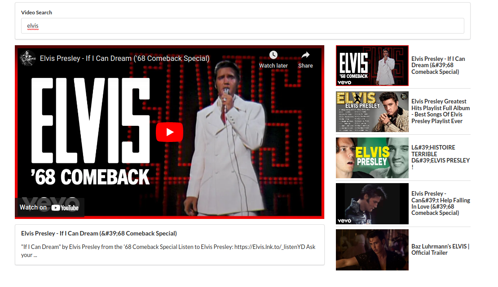

# Getting Started with React Youtube Clone by Alexander Binder

This project was bootstrapped with [Create React App](https://github.com/facebook/create-react-app).

By using the Google youtube Api : https://developers.google.com/youtube/v3

and on desgin react semantic ui : https://react.semantic-ui.com/
## Available Scripts

In the project directory, you can run:

### `npm start`

Runs the app in the development mode.\
Open [http://localhost:3000](http://localhost:3000) to view it in your browser.

